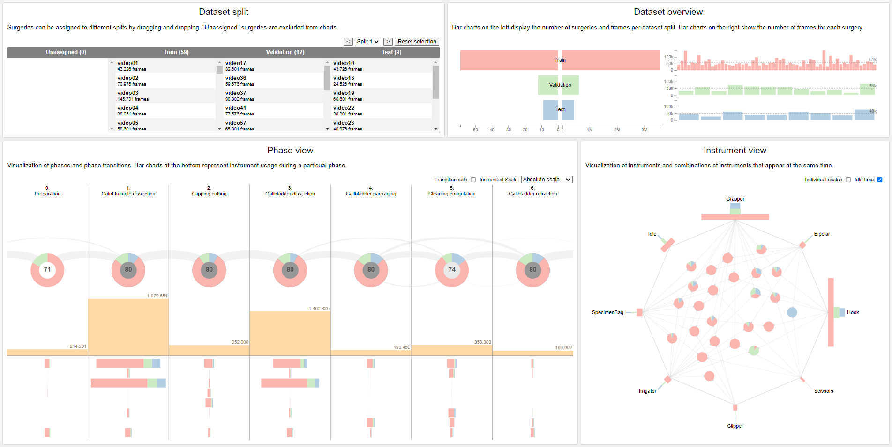

# EndovisML

EndovisML is a data visualization tool that allows interactive exploration of dataset splits for surgical phase recognition. In particular, this application focuses on the visualization of distributions of phases, phase transitions, instruments, and instrument combinations. When splitting imbalanced datasets into training, validation, and test sets, some classes may not be represented in one of the splits which may lead to misleading performance evaluation results. With the help of this application, the user can visualize a chosen dataset split and identify potential issues. To use this application the user needs to upload phase and instrument annotations in the CSV format as well as define dataset splits.

## Feature requests
We are actively working on improving the software and the user experience. If you have any comments or feature requests, send us an [E-Mail](mailto:georgii.kostiuchik@med.uni-heidelberg.de) or create an issue in this repository.
